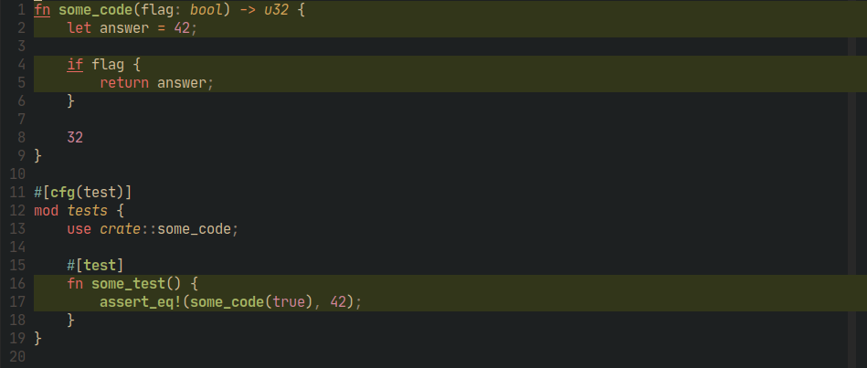

# rust-coverage.nvim

Rust code coverage inside Neovim

## Usage

It will set a `sign` highlighting the covered lines in the source code.

To generate the coverage information you just need to run the command:
`:RustCoverage`.

## Requires

This plugin needs a tool to create the code coverage information:

- [tarpaulin](https://github.com/xd009642/tarpaulin): currently the only tool
  supported

## Setup

With [packer.nvim](https://github.com/wbthomason/packer.nvim):

```lua
use {
  "joshuachp/rust-coverage.nvim",
  cmd = {"RustCoverage"},
  config = function() require("rust-coverage").setup() end,
}
```

## Example


